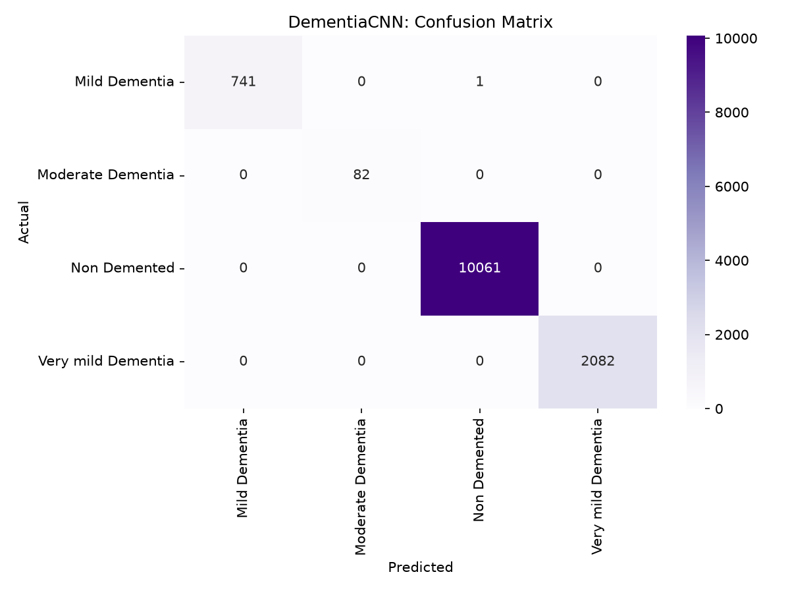
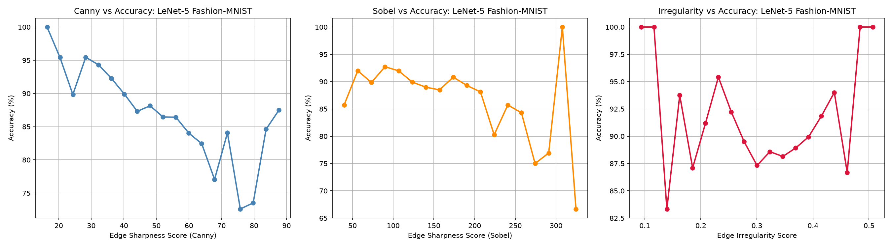
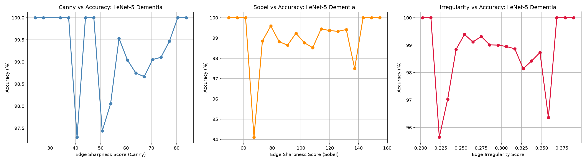
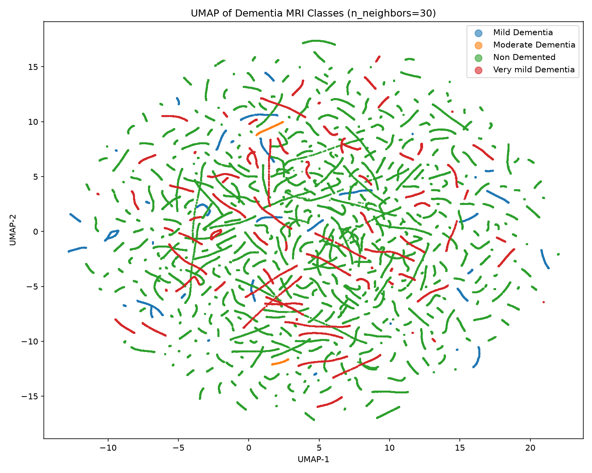

# Evaluating CNN Performance on MRI Scans and Low-Salience Shape Recognition

Classifying brain MRI slices into four dementia stages with LeNet-5, an MLP baseline and a custom CNN (**DementiaCNN**) built with Squeeze-and-Excite attention. Canny, Sobel and a new edge irregularity metric are then used to study *why* some images are hard to classify.

Joshua Ayaku and Gerardo Lozano, The University of Texas at Dallas. Written up as an IEEE-format research paper.

## Overview

Telling Non Demented, Very Mild, Mild and Moderate Dementia apart on an MRI is hard because the differences are subtle. There are no sharp, distinct shapes that separate the classes. We call this **low-salience shape recognition**. The project asks two questions:

1. Which architecture handles low-salience medical images best?
2. Does edge information (sharpness, gradient strength, irregularity) explain which images a model gets wrong?

Fashion-MNIST, which is clean, balanced and high-salience, is used as a reference point so the effect of the data can be separated from the effect of the model.

## Results

Test set results from the notebook in this repo (12,967 MRI test images, 10,000 Fashion-MNIST test images):

| Model | Dataset | Test accuracy | Macro F1 | Weighted F1 |
|---|---|---|---|---|
| LeNet-5 | Dementia MRI | 98.96% | 0.988 | 0.990 |
| MLP | Dementia MRI | 93.57% | 0.839 | 0.933 |
| **DementiaCNN** | Dementia MRI | **99.99%** | **0.9998** | **0.9999** |
| LeNet-5 | Fashion-MNIST | 89.45% | 0.894 | 0.894 |
| MLP | Fashion-MNIST | 86.91% | 0.869 | 0.869 |

Key findings:

* **Accuracy is misleading on this dataset.** Non Demented is 77% of the images and Moderate Dementia is under 1%, so macro F1 is the more honest metric. The MLP scores 93.6% accuracy but only 0.51 recall on Moderate Dementia, and its weighted F1 sits almost 0.1 above its macro F1.
* **Spatial structure matters.** LeNet-5 beats the MLP on both datasets, by about 5 points on the MRI data and about 2.5 points on Fashion-MNIST.
* **Channel attention helps the hard cases.** DementiaCNN got perfect recall on Moderate Dementia and Very Mild Dementia, and made a single error out of 12,967 test images (a Mild Dementia scan predicted as Non Demented).
* **Edges explain Fashion-MNIST errors but not MRI errors.** On Fashion-MNIST, accuracy drops from about 100% to about 72% as Canny edge density rises, and misclassified images have clearly higher edge scores. On the MRI data, accuracy stays between about 94% and 100% in every edge bin, and correct and incorrect predictions have nearly identical scores, which supports the low-salience hypothesis.



### Edge sensitivity: Fashion-MNIST vs Dementia MRI

Same LeNet-5 architecture, same three edge metrics. Accuracy moves a lot with edge content on Fashion-MNIST but barely moves on the MRI scans.





## Models

| Model | Summary |
|---|---|
| LeNet-5 | 2 conv layers (6 and 16 maps, 5x5) and 3 FC layers. ReLU and max pooling. Adam, lr 1e-3, 10 epochs |
| MLP | Flatten, then 512, 256 and 128 hidden units with dropout 0.3. Same training setup as LeNet-5 |
| DementiaCNN | 3 conv blocks (32, 64, 128 channels) with batch norm and SE attention, a depthwise-separable refinement stage, global average pooling and a dropout head. AdamW (lr 3e-4, wd 1e-4), cosine LR, label smoothing 0.05, gradient clipping and early stopping. 196,388 parameters |

## Dataset

86,437 grayscale brain MRI slices from the OASIS-based [Kaggle dataset](https://www.kaggle.com/datasets/ninadaithal/imagesoasis), organised into one folder per class:

| Class | Images |
|---|---|
| Non Demented | 67,222 |
| Very mild Dementia | 13,725 |
| Mild Dementia | 5,002 |
| Moderate Dementia | 488 |

All images are resized to 32x32 and split 70 / 15 / 15 into train, validation and test sets. Fashion-MNIST is downloaded automatically by torchvision.

The UMAP projection below (built on 230 PCA components) shows how heavily Non Demented (green) dominates. Each thin strand is a single class, most likely a run of neighboring slices from the same scan, and the strands of different classes are interleaved across the whole map instead of forming separate regions.



## Running it

```bash
pip install -r requirements.txt
```

1. Download the dataset zip from Kaggle and save it as `archive.zip` next to the notebook.
2. Open `ML_Project_Unified.ipynb` and run all cells.

Figures are saved to `figures/` and model weights to `models/`. A GPU is strongly recommended.

A fixed random seed was added when the original project notebooks were merged, so the results above differ slightly from the numbers in the paper. On a laptop CPU the full run took about 6 hours.

## Limitations and future work

* **The split is by image, not by patient.** Images were split randomly, so neighboring slices from the same scan very likely appear in both the training and test sets. The test accuracy probably overstates how well the models would do on new patients. A patient-level split is the most important next step.
* Heavy class imbalance. Oversampling, weighted loss or SMOTE would be the next step.
* 32x32 inputs throw away a lot of anatomical detail. 128x128 or 256x256 inputs are worth trying.
* DementiaCNN uses a different training recipe than the baselines, so an ablation study is needed to separate the effect of the architecture from the effect of the training tricks.

## Tech stack

Python, PyTorch, torchvision, scikit-learn, OpenCV, UMAP, pandas, NumPy, Matplotlib, seaborn
